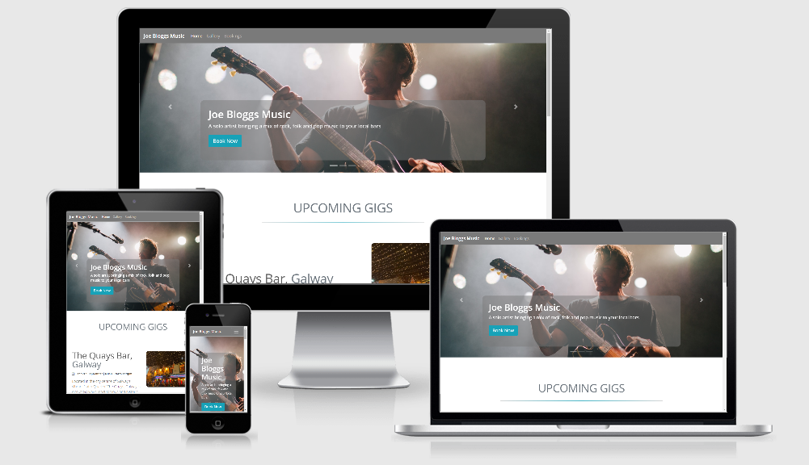

# Joe Bloggs Music

Joe Bloggs Music is a Milestone Project created for the "User Centric Development"
module of my FullStack Software Development Course offered by Code Institute.

The website is for a fictional musician named Joe Bloggs based in the city of Galway.
The website is to advertise upcoming shows, promote the artist, and also give the option to
make a booking.

### <a href="https://daniel-slattery.github.io/Musician-Website/" target="_blank">Link to live Website</a>

## UX

The purpose of the site is to promote the work of the Artist. This is done by showcasing photos and 
testimonials, and advertising upcoming shows. The function to book the artist via the website is also available.

The website is simple and structured in a way that is easy and intuitive to navigate through.

### User Stories
* As a user I want to find out the date and location of upcoming gigs. 
* As a user I also want to be able to navagate through photos and and navagate to the artists social media pages. 
* As a user I would also like to enquire about booking the artist.

## Features

### Existing Features
* Home - this page the intro section displays a carousel showcasing a brief introduction to Joe Bloggs
and what he's all about. 
There are two additional sections, "Upcoming Gigs" and "Testimonials" to advertise the artist.

* Gallery - A showcase of various pictures of equipment, the artist, the artists band members and live shows.

* Bookings - This page allows the user to fill out a form to enquire about making a booking.

## Technologies Used
1. HTML5: Used as the base for markup text. https://developer.mozilla.org/en-US/docs/Web/HTML

2. CSS3: Used as the base for cascading styles. https://www.w3.org/Style/CSS/Overview.en.html

3. Bootstrap: A CSS framework that assists the programmer in creating responsive, mobile first front-end web sites. https://getbootstrap.com/

4. Gitpod: An online IDE also used for creating & saving code that runs in a browser, it does not have to be installed on your PC. https://www.gitpod.io/

5. Git: A version control system for tracking changes in source code during software development. https://git-scm.com/

6. GitHub: A company that provides hosting for software development version control using Git. It is a subsidiary of Microsoft. https://github.

7. Chrome DevTools: A set of web developer tools built directly into the Google Chrome browser. https://developers.google.com/web/tools/chrome-devtools

8. W3C Markup Validation Service Used to run all html and css code thru a validation process looking for errors. https://validator.w3.org/ https://jigsaw.w3.org/css-validator/validator

## Testing
1. I have validated all HTML files and CSS using online validation sites cited below.
    *  #### HTML - [W3C HTML Validator](https://validator.w3.org/)
    *  #### CSS - [W3C CSS Validator](https://jigsaw.w3.org/css-validator/)

2. http://ami.responsivedesign.is/ has been used to see how the site performs on different view port sized devices.

3. Desktop
Google Chrome, Internet Edge & Mozilla Firefox browsers; all pages, links on those pages, and footer icon links perform well on all viewport sizes. 

4. Mobile
Chrome DevTools was used to test for the various mobile viewport sizes.

5. Booking Form
* Go to Bookings page
* Try to submit the form without a correct syntax e-mail address and you will get an error message requesting a proper e-mail address be entered.
* Trying to submit the form with any empty fields will also give you a "Please fill out this field" message.
* When you do hit the Submit button, the code-institute form dump page will load showing the details of info submitted from the form.

## Deployment
Joe Bloggs Music was developed using Gitpod, and all commits were pushed to Github using Git.

1. I uploaded all files to my Github repository located at this url; https://github.com/Daniel-Slattery/Musician-Website which is for this individual project.

2. To publish the project to see it working as a live website, I published the master branch of my 
Github repository using Github Pages. 
Web site is published at https://daniel-slattery.github.io/Musician-Website/

## Credits

### Content
1. Bootstrap 4.0 Examples; https://getbootstrap.com/docs/4.0/examples/carousel/ "Carousel". Used on my home page.

2. Google Fonts for font styles; https://fonts.google.com/

### Media
* Am I Responsive web site for checking responsiveness on all Apple devices screen sizes; http://ami.responsivedesign.is/
* Unsplash used for sourcing stock images;  https://unsplash.com/
### Acknowledgements
I received inspiration for this project from Code Institute - Project Ideas