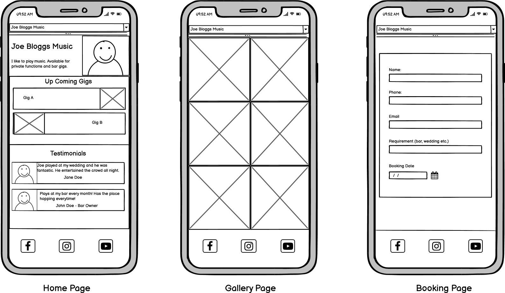

# <a href="https://daniel-slattery.github.io/Musician-Website/" target="_blank">Joe Bloggs Music</a>

Joe Bloggs Music is a Milestone Project created for the "User Centric Development"
module of my FullStack Software Development Course offered by Code Institute.

## Table of Contents
1. [Project overview](#project-overview) 
2. [UX](#UX)
    * [User Stories](#user-stories)
    * [Design](#design)
        * [Libraries used](#libraries)
        * [Color Scheme](#color-scheme)
        * [Typography](#typography)
    * [Wireframes](#wireframes)
        * [Desktop Layout](#desktop-layout)
        * [Mobile Layout](#mobile-layout)
3. [Features](#features)
    * [Existing Features](#existing-features)
    * [Features Left to Implement](#features-implement)
4. [Technologies Used](#technologies)
5. [Testing](#testing)
    * [Code Validators](#code-validators)
    * [Responsive Design Testing](#responsive)
    * [Browser Compatibility](#browser)
    * [Booking Form Testing](#booking)
6. [Deployment](#deployment)
7. [Credits](#credits)
    * [Content](#content)
    * [Media](#media)
    * [Acknowledgements](#acknowledgements)

<h2 id='project-overview'>Project overview</h2>
The website is for a fictional musician named Joe Bloggs based in the city of Galway.
The website is to advertise upcoming shows, promote the artist, and also give the option to
make a booking.

<h2 id='UX'>UX</h2>

The purpose of the site is to promote the work of the Artist. This is done by showcasing photos and 
testimonials, and advertising upcoming shows. The function to book the artist via the website is also available.

The website is simple and structured in a way that is easy and intuitive to navigate through.

<h3 id='user-stories'>User Stories</h3>

* As a user I want to find out the date and location of upcoming gigs. 
* As a user I also want to be able to navagate through photos and and navagate to the artists social media pages. 
* As a user I would also like to enquire about booking the artist.

<h3 id='design'>Design</h3> 
A standard layout is fully responsive on mobile devices and larger screens.

<h4 id='libraries'>Libraries Used</h4>

* Bootstrap 4 - is a framework for building responsive, mobile-first websites.

<h4 id='color-scheme'>Color Scheme</h4>

* 
* 
* 

<h4 id='typography'>Typography</h4>
2 Google Fonts were used across the site:

* Open Sans : body text
* Source Sans Pro : #gig-date, footer

<h3 id='wire-frames'>Wire Frames</h3>

* <h4 id='desktop'>Desktop Layout</h4>

    My desktop wireframes for this project can be found in the UX folder.

    *  [Desktop Wireframe](assets/UX/Desktop-Layout.pdf)

* <h4 id='mobile'>Mobile Layout</h4>
    My mobile wireframes for this project are shown below;

<h2 id='features'>Features</h2>

<h3 id='existing-features'>Existing Features</h3>

* Home - this page the intro section displays a carousel showcasing a brief introduction to Joe Bloggs
and what he's all about. 
There are two additional sections, "Upcoming Gigs" and "Testimonials" to advertise the artist.

* Gallery - A showcase of various pictures of equipment, the artist, the artists band members and live shows.

* Bookings - This page allows the user to fill out a form to enquire about making a booking.

<h3 id='features-implement'>Features Left to Implement</h3>

* A payment option - Add additional option to pay when making the booking.

<h2 id='technologies'>Technologies Used</h2>

1. HTML5: Used as the base for markup text. https://developer.mozilla.org/en-US/docs/Web/HTML

2. CSS3: Used as the base for cascading styles. https://www.w3.org/Style/CSS/Overview.en.html

3. Bootstrap: A CSS framework that assists the programmer in creating responsive, mobile first front-end web sites. https://getbootstrap.com/

4. Gitpod: An online IDE also used for creating & saving code that runs in a browser, it does not have to be installed on your PC. https://www.gitpod.io/

5. Git: A version control system for tracking changes in source code during software development. https://git-scm.com/

6. GitHub: A company that provides hosting for software development version control using Git. It is a subsidiary of Microsoft. https://github.

7. Chrome DevTools: A set of web developer tools built directly into the Google Chrome browser. https://developers.google.com/web/tools/chrome-devtools

8. W3C Markup Validation Service Used to run all html and css code thru a validation process looking for errors. https://validator.w3.org/ https://jigsaw.w3.org/css-validator/validator

<h2 id='testing'>Testing</h2>

Testing was conducted during this project to fix bugs and ensure the website worked as per user stories specifications. Below I outlined most of what I did below for 
documentation purposes.

<h3 id='code-validators'>Code Validators</h3>

I have validated all HTML files and CSS using online validation sites cited below.
*  HTML - [W3C HTML Validator](https://validator.w3.org/)
*  CSS - [W3C CSS Validator](https://jigsaw.w3.org/css-validator/)

<h3 id='responsive-design'>Responsive Design Testing</h3>

1. http://ami.responsivedesign.is/ has been used to see how the site performs on different view port sized devices.

2. Chrome DevTools was used to manually test for the various mobile viewport sizes.

<h3 id='browser'>Browser Compatibility</h3>

Google Chrome, Internet Edge & Mozilla Firefox browsers; all pages, links on those pages, and footer icon links perform well on all viewport sizes. 

<h3 id='booking'>Booking Form Testing</h3>

I tested the booking form on Google Chrome, Internet Edge & Mozilla Firefox and safari browsers. One issue I had was with the date input. Not all 
browsers recognise the date input type. I had to change this to input type to = 'text' and I added some custom javascript so the text input field behaved as a date input.

To test the Booking Form;
* Go to Bookings page
* Try to submit the form without a correct syntax e-mail address and you will get an error message requesting a proper e-mail address be entered.
* Trying to submit the form with any empty fields will also give you a "Please fill out this field" message.
* When you do hit the Submit button, the code-institute form dump page will load showing the details of info submitted from the form.

<h2 id='deployment'>Deployment</h2>

Joe Bloggs Music was developed using Gitpod, and all commits were pushed to Github using Git. In order to get the application ready for deployment I followed these steps:

1. I uploaded all files to my Github repository located at this url; https://github.com/Daniel-Slattery/Musician-Website which is for this individual project.

2. To publish the project to see it working as a live website, I then went into the Settings on my respository, scrolled down to the heading, GitHub Pages. Under the Source setting, 
I used the drop-down menu to select master branch as a publishing source and saved it. Refreshed the github page, and you are then given a url where your page is published; 
Your site is published at https://daniel-slattery.github.io/Musician-Website/

3. To run this code on your local machine, you would go to my respository at https://github.com/Daniel-Slattery/Musician-Website and on the home page on the right hand side 
just above all the files, you will see a green button that says, "Clone or download", this button will give you options to clone with HTTPS, open in desktop or download 
as a zip file. To continue with cloning, you would;
    * Open Git Bash
    * Change the current working directory to the location where you want the cloned directory to be made.
    * Type git clone, and then paste this URL; https://github.com/Daniel-Slattery/Musician-Website.git Press Enter. Your local clone will be created.
For more information about the above process; https://help.github.com/en/github/creating-cloning-and-archiving-repositories/cloning-a-repository

<h2 id='credits'>Credits</h2>

<h3 id='content'>Content</h3>

1. Bootstrap 4.0 Examples; https://getbootstrap.com/docs/4.0/examples/carousel/ "Carousel". Used on my home page.

2. Google Fonts for font styles; https://fonts.google.com/

<h3 id='media'>Media</h3>

* Am I Responsive web site for checking responsiveness on all Apple devices screen sizes; http://ami.responsivedesign.is/
* Unsplash used for sourcing stock images;  https://unsplash.com/

<h3 id='acknowledgements'>Acknowledgements</h3>

I received inspiration for this project from Code Institute - Project Ideas